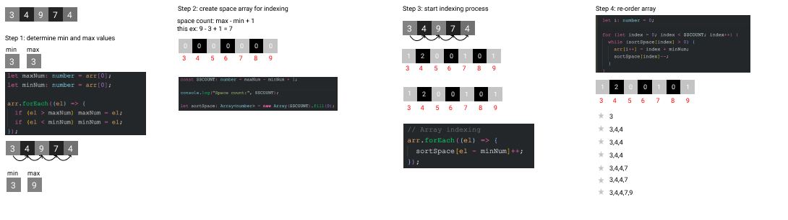

# Ankara Yildirim Beyazit University Computer Engineering Department
## CENG 303 - Design and Analysis Of Algorithm Group15 Term Project
<a href="http://aybu.edu.tr"></a>

Group Members
<a href="https://github.com/canumay" target="_blank">**@canumay**</a>
<a href="https://github.com/Aleynanana" target="_blank">**@Aleynanana**</a>
<a href="https://github.com/Arphat" target="_blank">**@Arphat**</a>
<a href="https://github.com/ozknsmz" target="_blank">**@ozknsmz**</a>
<a href="https://github.com/tolga-karabudak" target="_blank">**@tolga-karabudak**</a>

Scientific Paper: [A New Sort Algorithm: Self-Indexed Sort](https://www.researchgate.net/profile/Yingxu_Wang/publication/220178394_A_New_Sort_Algorithm_Self-Indexed_Sort/links/545c72ed0cf249070a7aa1e9/A-New-Sort-Algorithm-Self-Indexed-Sort.pdf)

### Installation

This repository requires [Node.js](https://nodejs.org/) to run.

Install the dependencies and devDependencies to run the code.

```sh
$ npm install
```

For development

```sh
$ npm run dev
```

For testing
```sh
$ npm run test
```

Manuel Test Results


Automated Test Results


Example Diagram


